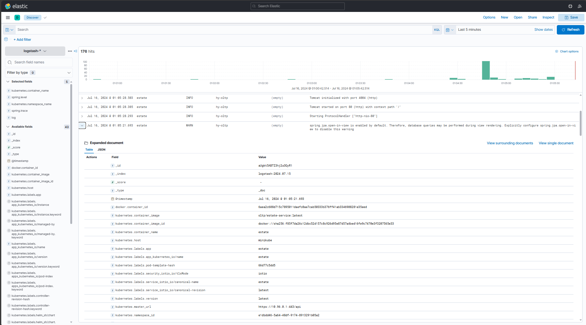
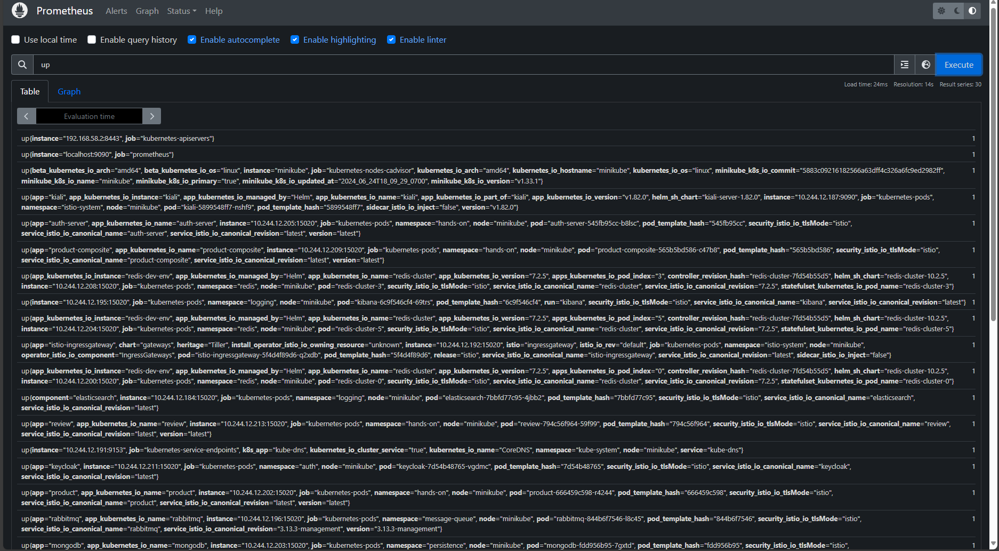
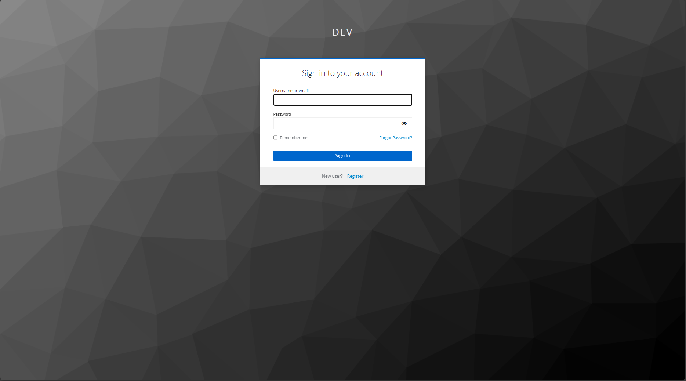
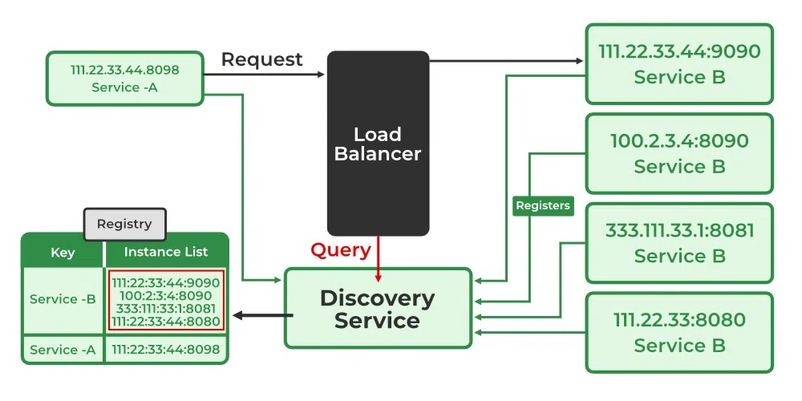
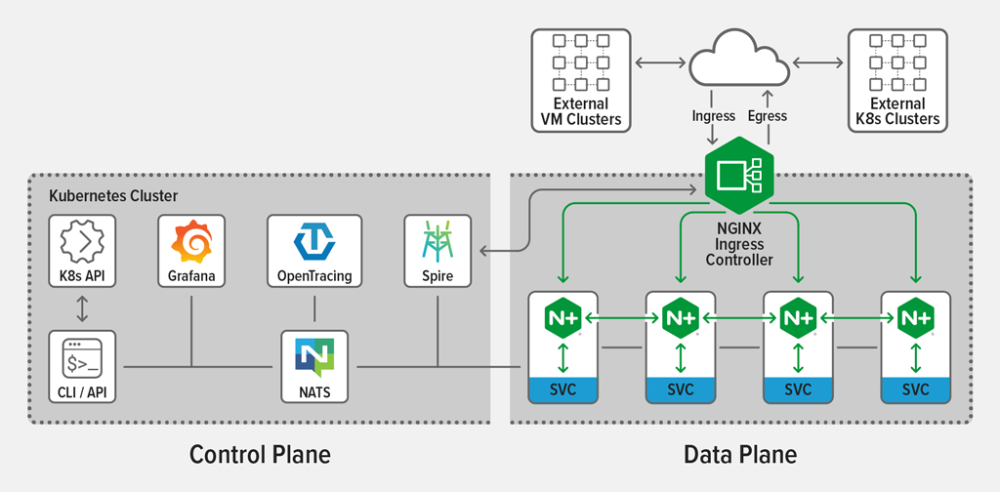
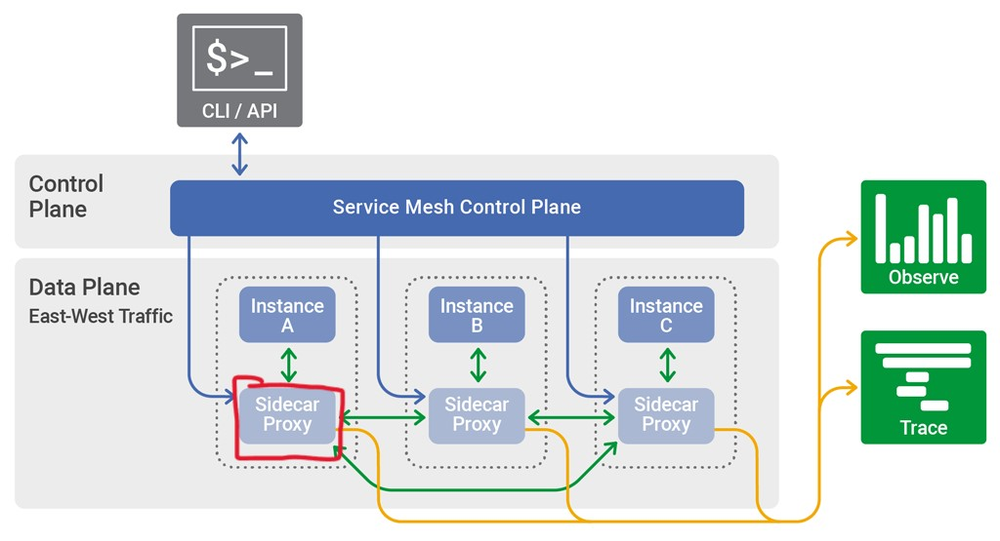

# 목차

- [목차](#목차)
  - [1. 모니터링 (Monitoring)](#1-모니터링-monitoring)
  - [2. 로깅 (Logging, Distributed Tracing)](#2-로깅-logging-distributed-tracing)
  - [3. 중앙집중적 API Documentation (Centralized Documentation)](#3-중앙집중적-api-documentation-centralized-documentation)
  - [4. 인증 (Authentication)](#4-인증-authentication)
  - [5. 중앙집중적 환경설정 (Centralized Configuration)](#5-중앙집중적-환경설정-centralized-configuration)
  - [6. 서비스 디스커버리 (Service Discovery)](#6-서비스-디스커버리-service-discovery)
  - [7. 엣지 서버 (Edge Server)](#7-엣지-서버-edge-server)
  - [8. 서비스 메시 (Service Mesh)](#8-서비스-메시-service-mesh)
  - [9. 프로젝트에 대하여 (요약)](#9-프로젝트에-대하여-요약)

## 1. 모니터링 (Monitoring)

1. Kubernetes 모니터링 (Kubenetes Monitoring)

2. Node / Network 모니터링 (Kaili)

3. System, Event 모니터링 (Prometheus, Grafana)

4. Redis Cache 모니터링 (Redis Insight)

5. 알림 기능 (mail-server, Alert Manager)

## 2. 로깅 (Logging, Distributed Tracing)

1. EFK stack

2. Prometheus

## 3. 중앙집중적 API Documentation (Centralized Documentation)

1. Swagger

2. (TODO: 나중에 할거임.) REST API DOCS

## 4. 인증 (Authentication)

1. Auth Server (Keycloak)

## 5. 중앙집중적 환경설정 (Centralized Configuration)

"Centralized Configuration"이란 service의 configuration (e.g. application.yml)이 하나의 포인트에서 관리됨을 의미합니다.

이는 configuration file 혹은 config Map이 service에 종속되지 않고 별도로 inject 될 수 있는 환경이 필요합니다.

1. config with kubernetes

2. [config with config server](https://docs.spring.io/spring-cloud-config/docs/current/reference/html/)

## 6. 서비스 디스커버리 (Service Discovery)

"Service Discovery"란 별도로 end point에 대한 정확한 정보 없이 DNS와 같은 시스템을 이용하여 해당 service를 찾아낼 수 있음을 의미합니다. Reverse Proxy를 좀 쉽게 하기 위한 좋은 도구입니다 ((see)[https://www.linkedin.com/pulse/role-reverse-proxy-microservices-architecture-getkitsune-maotc/])

1. [kubernetes istio](https://istio.io/latest/docs/ops/deployment/architecture/)

2. [eureka server](https://cloud.spring.io/spring-cloud-netflix/reference/html/)

## 7. 엣지 서버 (Edge Server)

reverse proxy라고 불리기도 하는 그거. 해당 프로젝트는 istio ingress controller를 쓸 예정입니다.

kubernetes ingress controller는 중요 요소이지만, 별도로 언급하지는 않습니다.

nginx는 그냥 보라고 넣었습니다.

spring gateway는 이전에 사용했기 때문에 reference를 넣었습니다.

1. [istio ingress controller](https://istio.io/latest/docs/tasks/traffic-management/ingress/ingress-control/)

2. [kubernetes ingress controller](https://kubernetes.io/docs/concepts/services-networking/ingress/)

3. [nginx ingress controller](https://docs.nginx.com/nginx-ingress-controller/)

4. [spring gateway](https://spring.io/projects/spring-cloud-gateway)

## 8. 서비스 메시 (Service Mesh)

Service Mesh란 service application의 비지니스 로직이 아닌 부분들에 대해서 공통적인 관심사를 추출하여 처리하는 구조를 말합니다. 이는 Spring AOP와 비슷하다고 보시면 됩니다. NGINX가 설명이 잘 되어있어 해당 그림을 가져왔으나, 본 프로젝트에서는 **Istio**를 사용합니다.

간략한 서비스 흐름은 다음과 같습니다. 물론 Istio 사용합니다. CDN 및 DDoS Protection은 없습니다.

## 9. 프로젝트에 대하여 (요약)

해당 프로젝트는 Micro Service를 위해서 [Spring Cloud](https://spring.io/projects/spring-cloud)를 사용한 이후 kubernetes를 사용하였습니다.

프로젝트는 Rest Controller를 위주로 별도로 Front Application는 없이 rest api만 지원함을 목표로 하였습니다.

본 프로젝트는 크게 두 가지 프로젝트로 구성되어 있습니다.

1. hands-on: web flux([spring reactive](https://spring.io/reactive)) 기반 microservice OLTP
2. hy-oltp: web mvc 기반 monolithic [OLTP](https://ko.wikipedia.org/wiki/%EC%98%A8%EB%9D%BC%EC%9D%B8_%ED%8A%B8%EB%9E%9C%EC%9E%AD%EC%85%98_%EC%B2%98%EB%A6%AC) (참조: [OALP](https://ko.wikipedia.org/wiki/%EC%98%A8%EB%9D%BC%EC%9D%B8_%EB%B6%84%EC%84%9D_%EC%B2%98%EB%A6%AC)).
* hands-on은 OLTP이긴 하지만 "eventually consistency" concept를 지니고 있습니다. 즉 transaction이 엄밀하게 지켜지지는 않습니다.

마이크로 서비스가 주요 목표인 프로젝트에서, OLTP 서비스를 구현한 이유는 cloud 환경의 기능들을 잘 활용하면 기존의 어려운 문제점들을 해결하기 위한 하나의 실마리가 될 수 있다고 생각하였기 때문입니다.

프로젝트의 상세에 대해서는 추후 상세하게 말씀드리겠습니다.