# 목차

- [목차](#목차)
  - [1. 모니터링 (Monitoring)](#1-모니터링-monitoring)
    - [Kubernetes 모니터링 (Kubenetes Monitoring)](#kubernetes-모니터링-kubenetes-monitoring)
      - [Kubernetes Dashboard](#kubernetes-dashboard)
      - [Kubernetes Dashboard의 주요 기능](#kubernetes-dashboard의-주요-기능)
      - [결론](#결론)
    - [Node / Network 모니터링 (Kaili)](#node--network-모니터링-kaili)
      - [Kiali](#kiali)
      - [Kiali의 주요 기능](#kiali의-주요-기능)
      - [결론](#결론-1)
    - [System, Event 모니터링 (Prometheus, Grafana)](#system-event-모니터링-prometheus-grafana)
      - [Grafana](#grafana)
      - [Grafana의 주요 기능](#grafana의-주요-기능)
      - [결론](#결론-2)
    - [Redis Cache 모니터링 (Redis Insight)](#redis-cache-모니터링-redis-insight)
      - [Redis Insight](#redis-insight)
      - [Redis Insight의 주요 기능](#redis-insight의-주요-기능)
      - [결론](#결론-3)
    - [알림 기능 (Mail Dev, Alert Manager)](#알림-기능-mail-dev-alert-manager)
      - [MailDev](#maildev)
      - [MailDev의 주요 기능](#maildev의-주요-기능)
      - [결론](#결론-4)
  - [2. 로깅 (Logging, Distributed Tracing)](#2-로깅-logging-distributed-tracing)
    - [EFK stack](#efk-stack)
      - [주요 구성 요소](#주요-구성-요소)
      - [EFK 스택의 장점](#efk-스택의-장점)
      - [결론](#결론-5)
    - [Prometheus](#prometheus)
      - [주요 기능](#주요-기능)
      - [아키텍처](#아키텍처)
  - [3. 중앙 집중식 API Documentation (Centralized Documentation)](#3-중앙-집중식-api-documentation-centralized-documentation)
      - [Centralized API Documentation in Microservices Using Spring Boot](#centralized-api-documentation-in-microservices-using-spring-boot)
      - [주요 구성 요소 및 단계](#주요-구성-요소-및-단계)
      - [결론](#결론-6)
  - [4. 인증 (Authentication)](#4-인증-authentication)
      - [Keycloak](#keycloak)
      - [Keycloak의 주요 기능](#keycloak의-주요-기능)
      - [결론](#결론-7)
  - [5. 중앙집중적 환경설정 (Centralized Configuration)](#5-중앙집중적-환경설정-centralized-configuration)
    - [Spring Cloud Config Server](#spring-cloud-config-server)
      - [Spring Cloud Config Server의 주요 기능](#spring-cloud-config-server의-주요-기능)
      - [결론](#결론-8)
  - [6. 서비스 디스커버리 (Service Discovery)](#6-서비스-디스커버리-service-discovery)
      - [Spring Cloud Netflix Service Discovery](#spring-cloud-netflix-service-discovery)
      - [주요 기능](#주요-기능-1)
      - [결론](#결론-9)
  - [7. 엣지 서버 (Edge Server)](#7-엣지-서버-edge-server)
  - [8. 서비스 메시 (Service Mesh)](#8-서비스-메시-service-mesh)
  - [9. 프로젝트에 대하여 (요약)](#9-프로젝트에-대하여-요약)

## 1. 모니터링 (Monitoring)

모니터링은 현재 시스템의 상태를 분석할 수 있는 도구입니다. 해당 프로젝트에서는 크게 5가지의 모니터링 도구가 사용되고 있습니다.

### Kubernetes 모니터링 (Kubenetes Monitoring)

#### [Kubernetes Dashboard](https://kubernetes.io/docs/tasks/access-application-cluster/web-ui-dashboard/)

Kubernetes 클러스터를 운영하는 과정에서, 다양한 리소스와 애플리케이션의 상태를 실시간으로 모니터링하고 효율적으로 관리하는 것은 매우 중요합니다. 그러나 커맨드 라인 인터페이스(CLI)만을 이용하여 이러한 작업을 수행하는 것은 때때로 번거롭고 비효율적일 수 있습니다. 특히, 클러스터 내 리소스의 상태를 시각적으로 파악하고, 문제를 신속하게 진단하며, 관리 작업을 간편하게 수행하기 위해 직관적인 사용자 인터페이스(UI)가 필요합니다.

#### Kubernetes Dashboard의 주요 기능

1. **클러스터 상태 모니터링**: 클러스터 내의 모든 노드, 파드, 서비스 등의 상태를 실시간으로 모니터링할 수 있습니다.
2. **애플리케이션 관리**: 애플리케이션의 배포, 업데이트, 삭제 등의 작업을 간편하게 수행할 수 있습니다.
3. **리소스 관리**: 다양한 Kubernetes 리소스를 손쉽게 생성, 업데이트, 삭제할 수 있습니다.
4. **로그 및 이벤트 확인**: 파드의 로그를 실시간으로 확인하고, 클러스터 내에서 발생하는 이벤트를 모니터링하여 신속하게 대응할 수 있습니다.
5. **터미널 접근**: 웹 UI를 통해 직접 파드에 터미널로 접근하여 명령어를 실행하고 문제를 진단할 수 있습니다.

#### 결론

Kubernetes Dashboard는 클러스터 운영을 보다 직관적이고 효율적으로 만들어주는 강력한 도구입니다. 이를 통해 운영자는 복잡한 클러스터를 쉽게 관리하고, 문제를 신속하게 해결하며, 클러스터의 전반적인 상태를 시각적으로 파악할 수 있습니다. Kubernetes Dashboard를 사용함으로써 클러스터 운영의 복잡성을 줄이고 생산성을 높일 수 있습니다.

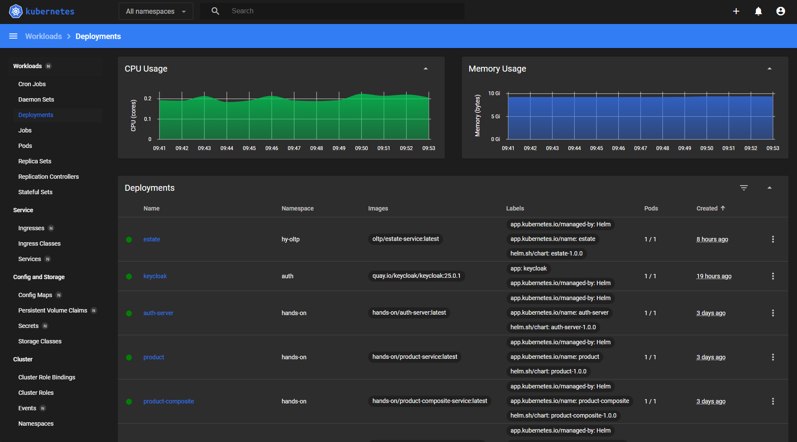

### Node / Network 모니터링 (Kaili)

#### [Kiali](https://istio.io/latest/docs/ops/integrations/kiali/)

Kubernetes 환경에서 Istio 서비스 메쉬를 운영할 때, 서비스 간의 복잡한 상호작용과 트래픽 흐름을 이해하고 모니터링하는 것은 매우 중요합니다. 그러나 이러한 작업을 커맨드 라인 인터페이스(CLI)만으로 수행하는 것은 번거롭고 비효율적일 수 있습니다. 이 때, Kiali는 직관적인 사용자 인터페이스(UI)를 통해 Istio 서비스 메쉬를 시각적으로 모니터링하고 관리할 수 있도록 도와줍니다.

#### Kiali의 주요 기능

1. **서비스 메쉬 시각화**: 서비스 간의 트래픽 흐름, 의존 관계, 호출 패턴 등을 그래프 형태로 시각화하여 이해하기 쉽게 제공합니다.
2. **헬스 체크 및 메트릭스**: 서비스와 메쉬의 전반적인 상태를 모니터링하고, 다양한 성능 지표와 헬스 체크 결과를 실시간으로 확인할 수 있습니다.
3. **트래픽 관리**: 트래픽 라우팅, 레이트 리밋, 트래픽 분산 등의 Istio 기능을 시각적으로 구성하고 관리할 수 있습니다.
4. **분석 및 디버깅**: 트래픽 흐름을 분석하고, 서비스 간의 문제를 신속하게 진단하여 해결할 수 있도록 돕습니다.
5. **통합 대시보드**: Prometheus, Grafana 등 다양한 모니터링 도구와 통합하여 보다 종합적인 모니터링 환경을 제공합니다.

#### 결론

Kiali는 Istio 서비스 메쉬를 운영하는 데 있어 필수적인 도구로, 복잡한 서비스 간의 상호작용을 시각적으로 이해하고 관리할 수 있도록 돕습니다. 이를 통해 운영자는 서비스 메쉬의 상태를 쉽게 모니터링하고, 문제를 신속하게 해결하며, 트래픽 관리 작업을 효율적으로 수행할 수 있습니다. Kiali를 사용함으로써 Istio 서비스 메쉬의 운영 복잡성을 줄이고 운영 효율성을 높일 수 있습니다.

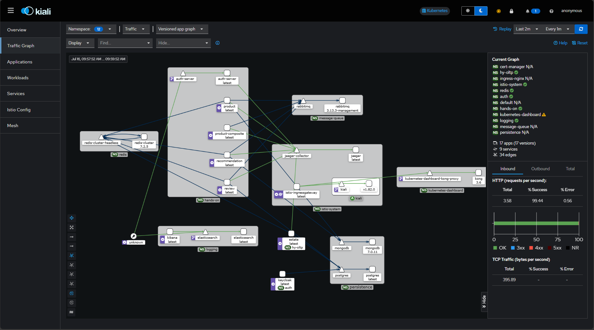

### System, Event 모니터링 (Prometheus, Grafana)

#### [Grafana](https://grafana.com/docs/grafana/latest/introduction/)

Grafana는 오픈 소스 시각화 및 분석 소프트웨어로, 다양한 위치에 저장된 메트릭스, 로그, 추적 데이터를 쿼리, 시각화, 알림 설정 및 탐색할 수 있게 해줍니다. 이를 통해 시계열 데이터베이스(TSDB) 데이터를 인사이트가 담긴 그래프와 시각화 자료로 변환할 수 있는 도구를 제공합니다.

#### Grafana의 주요 기능

1. **메트릭스, 로그 및 추적 탐색**: 즉석 쿼리와 동적 드릴다운을 통해 데이터를 탐색할 수 있습니다. 여러 시간 범위, 쿼리 및 데이터 소스를 나란히 비교할 수 있습니다.
2. **알림 설정**: PagerDuty, SMS, 이메일, VictorOps, OpsGenie, Slack 등의 다양한 알림 수신자를 통해 알림을 보낼 수 있으며, 시각적으로 중요한 메트릭스에 대한 알림 규칙을 정의할 수 있습니다.
3. **주석**: 다양한 데이터 소스에서 리치 이벤트를 그래프에 주석으로 추가하여, 이벤트 메타데이터와 태그를 확인할 수 있습니다. 이는 문제가 발생했을 때 데이터 상관관계를 이해하는 데 유용합니다.
4. **대시보드 변수**: 템플릿 변수를 사용해 재사용 가능한 대시보드를 만들 수 있습니다. 이는 여러 용도로 활용할 수 있으며, 다른 팀과 공유할 수 있습니다.
5. **구성**: 관리자라면 구성 파일과 환경 변수를 통해 Grafana 설정을 맞춤 구성할 수 있습니다. 여기에는 기본 포트, 로깅 수준, 이메일 IP 주소, 보안 설정 등이 포함됩니다.
6. **대시보드 및 플러그인 가져오기**: 공식 라이브러리에서 수백 개의 대시보드와 플러그인을 발견하고 사용할 수 있습니다.
7. **인증**: LDAP, OAuth 등의 다양한 인증 방법을 지원하며, 사용자를 조직에 매핑할 수 있습니다.

#### 결론

Grafana는 다양한 데이터 소스에서 메트릭스, 로그 및 추적 데이터를 효과적으로 시각화하고 분석할 수 있는 강력한 도구입니다. 이를 통해 사용자는 데이터를 심층적으로 탐색하고, 실시간 알림을 설정하며, 문제 발생 시 신속하게 대응할 수 있습니다. Grafana의 오픈 소스 특성과 풍부한 기능은 IT 운영, 개발 및 모니터링 작업을 한층 더 효율적이고 효과적으로 만들어줍니다.

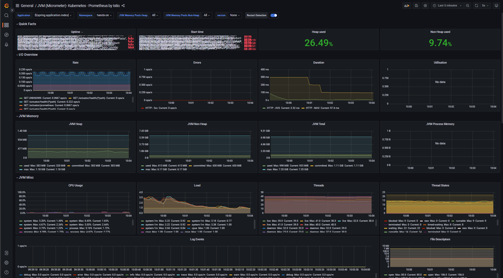

### Redis Cache 모니터링 (Redis Insight)

#### [Redis Insight](https://redis.io/docs/latest/develop/connect/insight/)

Redis Insight는 Redis 또는 Redis Stack에서 데이터를 시각화하고 최적화할 수 있는 강력한 도구로, 실시간 애플리케이션 개발을 더욱 쉽게 만듭니다. Redis Insight를 통해 그래픽 사용자 인터페이스(GUI)와 명령 줄 인터페이스(CLI) 기반의 상호작용이 가능합니다.

#### Redis Insight의 주요 기능

1. **연결 관리**: 로컬 Redis 또는 Redis Stack 데이터베이스를 자동으로 탐지하고 추가할 수 있으며, Redis Enterprise Cluster와 Redis Cloud에서도 데이터베이스를 탐색할 수 있습니다.
2. **브라우저**: 키-값 Redis 데이터 구조를 탐색하고 시각화하며, CRUD 작업을 지원합니다. JSON 데이터 형식도 지원하여 데이터 구조를 쉽게 관리할 수 있습니다.
3. **프로파일러**: Redis에 전송된 모든 명령을 실시간으로 분석하여 성능을 최적화합니다.
4. **워크벤치**: 명령어 자동 완성 기능과 복잡한 데이터 시각화 기능을 갖춘 고급 명령 줄 인터페이스입니다. Redis 및 Redis Stack 기능을 편리하게 발견할 수 있습니다.
5. **데이터베이스 분석**: 데이터 유형 분포와 메모리 할당을 검사하여 Redis 데이터베이스의 성능과 메모리 사용을 최적화합니다.
6. **스트림 관리**: 스트림을 생성, 관리하고, 스트림 항목을 타임스탬프별로 필터링하며, 소비자 그룹을 관리할 수 있습니다.
7. **검색 기능**: Redis Stack의 인덱싱, 쿼리 및 전체 텍스트 검색 기능을 UI를 통해 빠르고 편리하게 실행할 수 있습니다.
8. **일괄 작업**: 동일한 유형의 여러 키를 한 번에 삭제하여 데이터베이스의 사용을 최적화할 수 있습니다.

#### 결론

Redis Insight는 Redis 데이터베이스의 시각화 및 최적화를 통해 실시간 애플리케이션 개발을 지원하는 필수 도구입니다. 이를 통해 사용자는 데이터를 쉽게 탐색하고, 성능을 최적화하며, 문제를 신속하게 해결할 수 있습니다. Redis Insight를 사용함으로써 Redis 데이터베이스의 관리 및 운영 효율성을 높일 수 있습니다.

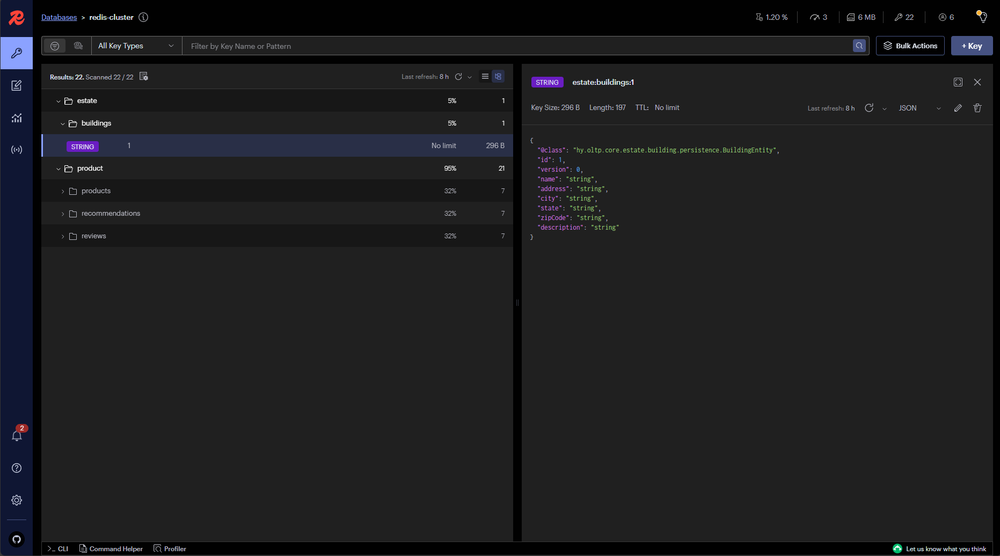

### 알림 기능 (Mail Dev, Alert Manager)

#### [MailDev](https://github.com/maildev/maildev)

MailDev는 개발 환경에서 프로젝트가 생성한 이메일을 테스트할 수 있는 간단한 도구로, 사용하기 쉬운 웹 인터페이스를 제공하며 로컬 머신에서 실행됩니다. Node.js 기반으로 구축된 MailDev는 이메일 개발 및 디버깅 과정을 크게 단순화해줍니다.

#### MailDev의 주요 기능

1. **웹 인터페이스**: 이메일을 쉽게 확인하고 테스트할 수 있는 직관적인 GUI를 제공합니다. HTML, 텍스트, 헤더, 원본 소스 등 다양한 형식으로 이메일을 볼 수 있습니다.
2. **실시간 업데이트**: WebSocket 통합을 통해 새로운 이메일이 수신될 때마다 실시간으로 인터페이스가 업데이트됩니다.
3. **브라우저 알림**: 새로운 이메일이 도착할 때 브라우저 알림을 받을 수 있습니다.
4. **이메일 검색**: 받은 이메일을 신속하게 찾을 수 있는 편리한 검색 기능을 제공합니다.
5. **CLI 지원**: 명령 줄 인터페이스를 통해 SMTP 및 웹 인터페이스 포트를 구성할 수 있습니다.
6. **REST API**: 프로그램적으로 이메일을 관리할 수 있는 REST API를 제공합니다.
7. **자동 릴레이 모드**: 자동 릴레이 모드를 활성화하면 각 이메일을 지정된 수신자에게 자동으로 전송할 수 있습니다.
8. **다양한 이메일 형식 지원**: 첨부 파일을 포함한 다양한 이메일 형식을 지원하며, 이메일 응답성을 테스트할 수 있는 기능을 갖추고 있습니다.
9. **Docker 지원**: Docker 이미지를 사용하여 쉽게 MailDev를 실행할 수 있습니다.

#### 결론

MailDev는 개발자가 이메일 관련 기능을 손쉽게 테스트하고 디버그할 수 있도록 도와주는 필수 도구입니다. 이를 통해 이메일 전송 및 수신 과정에서 발생할 수 있는 문제를 신속하게 파악하고 해결할 수 있습니다. MailDev는 단순하지만 강력한 기능을 제공하여 개발 환경에서 이메일 작업을 크게 효율화할 수 있습니다.

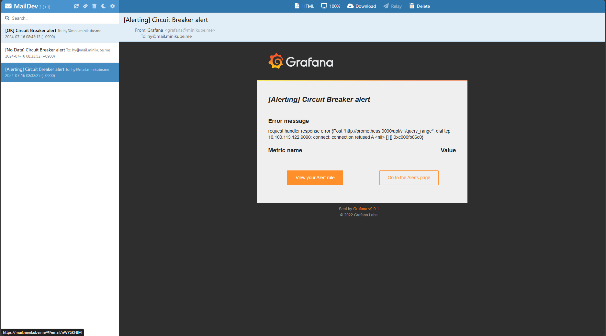

## 2. 로깅 (Logging, Distributed Tracing)

### EFK stack

EFK 스택은 Kubernetes 환경에서 로그를 효율적으로 관리하기 위한 오픈 소스 솔루션입니다. EFK는 Elasticsearch, Fluentd, 그리고 Kibana의 약자로, 로그 수집, 저장, 분석을 위한 강력한 도구 세트를 제공합니다.

#### 주요 구성 요소

1. **Elasticsearch**
   - **역할**: 로그 데이터를 중앙 집중식으로 저장하고 검색할 수 있는 분산형 검색 엔진입니다.
   - **특징**: 높은 확장성과 성능을 자랑하며, 다양한 로그 데이터를 효율적으로 인덱싱하고 검색할 수 있습니다.

2. **Fluentd**
   - **역할**: 다양한 데이터 소스에서 로그를 수집하여 Elasticsearch로 전달하는 로그 수집기입니다.
   - **특징**: 플러그인 기반 아키텍처를 통해 유연성이 높고, 다양한 데이터 출력 형식을 지원합니다.

3. **Kibana**
   - **역할**: Elasticsearch에 저장된 로그 데이터를 시각화하고 분석할 수 있는 대시보드 및 쿼리 도구입니다.
   - **특징**: 사용자 친화적인 UI를 제공하여 로그 데이터를 쉽게 탐색하고, 대시보드를 통해 로그를 시각화할 수 있습니다.

#### EFK 스택의 장점

1. **중앙 집중식 로그 관리**: EFK 스택은 Kubernetes 클러스터 내의 모든 로그를 중앙에서 관리하여, 로그 분석과 문제 해결을 간편하게 만듭니다.
2. **실시간 로그 분석**: Fluentd는 실시간으로 로그를 수집하고 전송하며, Kibana를 통해 실시간으로 로그를 분석할 수 있습니다.
3. **확장성 및 유연성**: Elasticsearch는 높은 확장성을 제공하며, Fluentd는 다양한 플러그인을 통해 유연하게 로그를 처리할 수 있습니다.
4. **강력한 검색 및 쿼리 기능**: Elasticsearch의 강력한 검색 기능과 Kibana의 시각화 도구를 통해 로그 데이터를 쉽게 검색하고 분석할 수 있습니다.

#### 결론

EFK 스택은 Kubernetes 환경에서 로그를 효과적으로 관리하고 분석하기 위한 필수 도구입니다. 이를 통해 운영자는 로그 데이터를 실시간으로 수집, 저장, 분석하여 시스템의 상태를 모니터링하고 문제를 신속하게 해결할 수 있습니다. EFK 스택은 로그 관리의 복잡성을 줄이고 운영 효율성을 높이는 데 중요한 역할을 합니다.

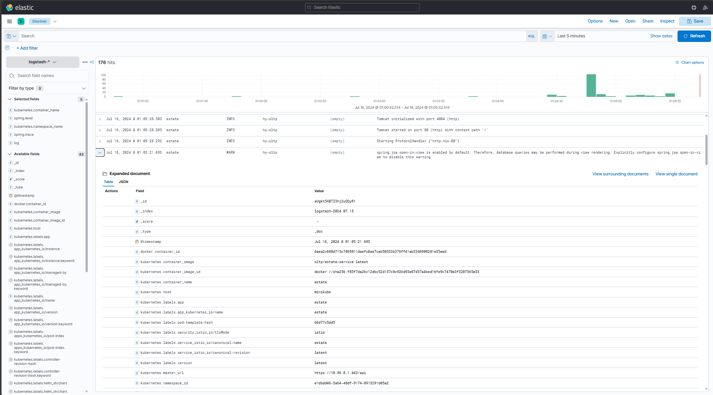

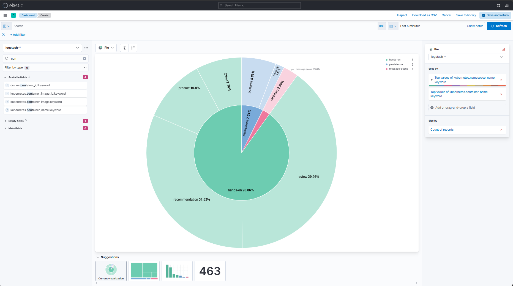

### [Prometheus](https://prometheus.io/docs/introduction/overview/)

Prometheus는 오픈 소스 시스템 모니터링 및 알림 도구로, 다음과 같은 주요 기능을 제공합니다:

#### 주요 기능

1. **다차원 데이터 모델**: Prometheus는 시간 시리즈 데이터를 기반으로 하며, 메트릭 이름과 키-값 쌍으로 식별되는 다차원 데이터를 저장합니다.
2. **PromQL**: Prometheus Query Language를 사용하여 복잡한 쿼리를 실행하고 데이터를 분석할 수 있습니다.
3. **자체 서버**: 분산 저장소에 의존하지 않고 독립적인 서버 노드로 운영됩니다.
4. **풀 모델**: HTTP를 통해 메트릭 데이터를 수집합니다.
5. **다양한 데이터 시각화**: Grafana 등과 통합하여 데이터를 시각화하고 대시보드를 구성할 수 있습니다.

#### 아키텍처

Prometheus의 기본 아키텍처는 다음과 같은 구성 요소로 이루어져 있습니다:
- **Prometheus 서버**: 메트릭 데이터를 스크랩하고 저장합니다.
- **타겟**: 모니터링 대상 애플리케이션 또는 서비스로, 메트릭 데이터를 노출합니다.
- **Alertmanager**: 사전 설정된 규칙에 따라 알림을 관리하고 전송합니다.

Prometheus는 신뢰성을 중시하여 네트워크 스토리지나 다른 원격 서비스에 의존하지 않고 독립적으로 작동합니다. 이는 시스템 장애 시에도 신속하게 문제를 진단할 수 있도록 도와줍니다.

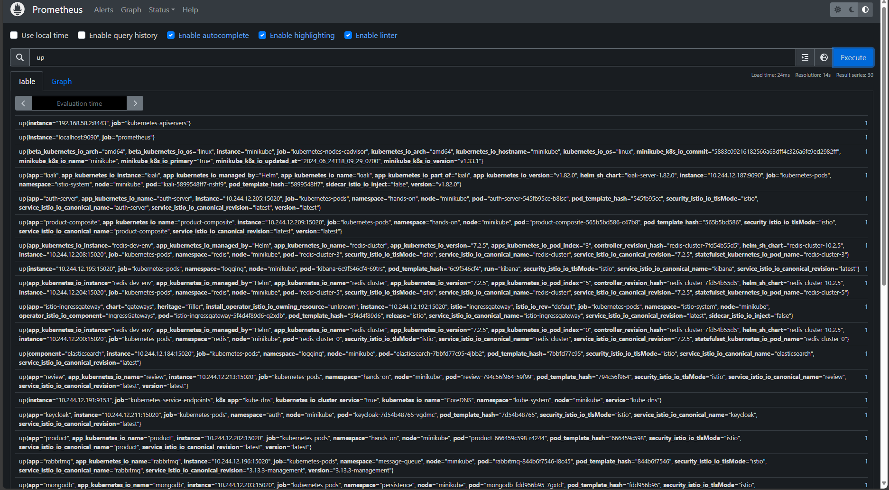

## 3. 중앙 집중식 API Documentation (Centralized Documentation)

1. Swagger

#### [Centralized API Documentation in Microservices Using Spring Boot](https://dzone.com/articles/centralized-documentation-in-microservice-spring-b)

마이크로서비스 환경에서는 각 서비스가 고유한 API 엔드포인트와 문서를 가지고 있어 이를 관리하고 접근하는 데 어려움이 있습니다. 중앙 집중식 API 문서화는 이러한 문제를 해결하기 위해 모든 API 정의를 하나의 통합된 인터페이스에 수집합니다.

#### 주요 구성 요소 및 단계

1. **Swagger-UI 통합**:
   - **Swagger-UI**: API 엔드포인트를 문서화하고 테스트할 수 있는 사용자 친화적인 웹 인터페이스를 제공합니다.

2. **Service Registry**:
   - **Eureka**: 마이크로서비스 아키텍처에서 서비스를 검색하고 등록하는 데 도움을 주는 서비스 레지스트리입니다.
   - **중앙 문서화 서비스**: 여러 마이크로서비스의 API 문서를 수집하고 제공하는 중앙 집중식 문서화 서비스를 제공합니다.

3. **구현 단계**:
   - **등록된 서비스 가져오기**: Eureka에서 등록된 서비스 인스턴스 목록을 가져옵니다.
   - **Swagger 정의 가져오기**: 각 서비스에서 Swagger 정의 JSON을 가져와서 메모리에 저장합니다.
   - **정기 업데이트**: 저장된 정의를 주기적으로 갱신하여 서비스의 최신 상태를 반영합니다.
   - **통합 엔드포인트 제공**: 수집된 Swagger 정의를 제공하는 단일 엔드포인트를 통해 모든 API 문서에 접근할 수 있습니다.

#### 결론

중앙 집중식 API 문서화는 여러 마이크로서비스의 API 문서에 쉽게 접근할 수 있게 하여 개발 및 유지보수 과정을 단순화합니다. 이를 통해 개발자는 API 문서를 한 곳에서 관리하고, 서비스 간의 통합을 더 원활하게 진행할 수 있습니다.

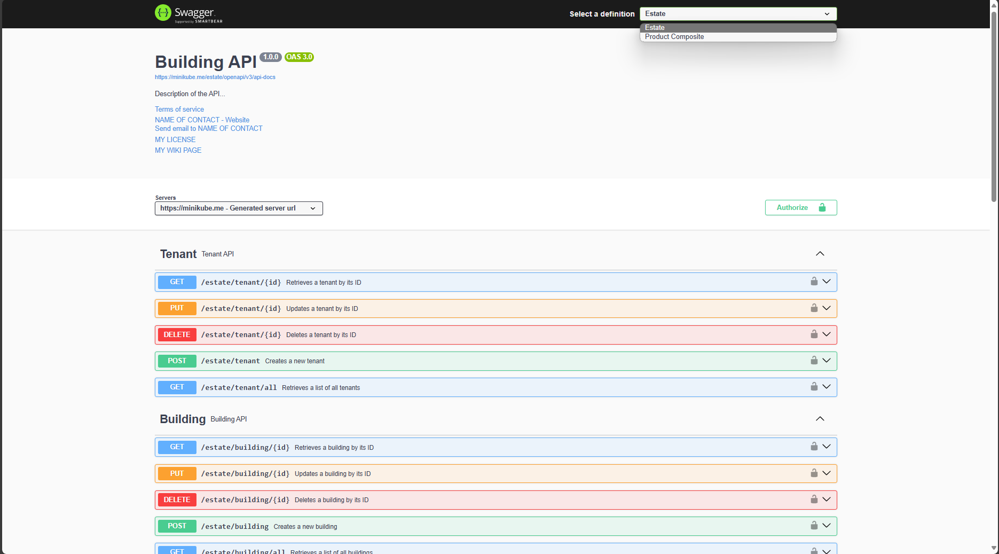

1. (TODO: 나중에 할거임.) REST API DOCS

## 4. 인증 (Authentication)

1. Auth Server (Keycloak)

#### [Keycloak](https://www.keycloak.org/)

Keycloak는 오픈 소스 아이덴티티 및 접근 관리 솔루션으로, 애플리케이션에 인증을 추가하고 서비스를 최소한의 노력으로 보호할 수 있도록 도와줍니다. 사용자 저장 및 인증을 직접 처리할 필요가 없으며, 중앙 관리형 콘솔을 통해 다양한 기능을 손쉽게 관리할 수 있습니다.

#### Keycloak의 주요 기능

1. **SSO**: 사용자는 개별 애플리케이션이 아닌 Keycloak을 통해 인증됩니다. 한 번 로그인하면 여러 애플리케이션에 다시 로그인할 필요가 없습니다.
2. **Identity Broker 및 Social Login**: 관리 콘솔을 통해 소셜 네트워크 로그인 기능을 쉽게 추가할 수 있으며, OpenID Connect 또는 SAML 2.0 아이덴티티 프로바이더와 연동할 수 있습니다.
3. **User Federation**: 기존 LDAP 또는 Active Directory 서버와의 연동을 지원하며, 자체 프로바이더를 구현하여 다른 저장소와 연동할 수 있습니다.
4. **Management Console**: Keycloak 서버의 모든 측면을 중앙에서 관리할 수 있습니다. 애플리케이션 및 서비스 생성, 사용자 관리, 세션 관리 등을 포함합니다.
5. **User Account Console**: 사용자가 자신의 계정을 관리할 수 있는 인터페이스를 제공하여, 프로필 업데이트, 비밀번호 변경, 이중 인증 설정 등을 할 수 있습니다.
6. **표준 프로토콜 지원**: OpenID Connect, OAuth 2.0, SAML을 지원하여 다양한 환경에서 활용할 수 있습니다.
7. **권한 관리 서비스**: 역할 기반 권한 관리 외에도 세부적인 권한 정책을 정의할 수 있는 기능을 제공합니다.

#### 결론

Keycloak는 강력한 아이덴티티 및 접근 관리 솔루션으로, 다양한 표준 프로토콜과의 호환성을 통해 애플리케이션 보안을 강화하고 관리 효율성을 높일 수 있습니다. 이를 통해 사용자는 중앙에서 인증 및 권한 관리를 간편하게 수행할 수 있습니다.

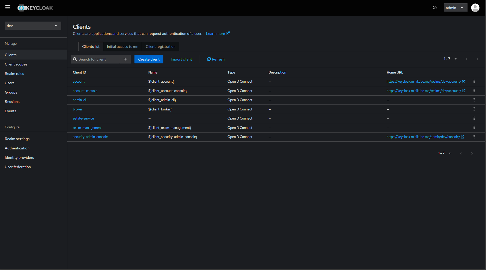

## 5. 중앙집중적 환경설정 (Centralized Configuration)

"Centralized Configuration"이란 service의 configuration (e.g. application.yml)이 하나의 포인트에서 관리됨을 의미합니다.

이를 위해서는 configuration file 혹은 config Map이 service에 종속되지 않고 별도로 inject 될 수 있는 환경이 필요합니다.

### [Spring Cloud Config Server](https://docs.spring.io/spring-cloud-config/docs/current/reference/html/)

Spring Cloud Config Server는 분산 시스템에서 외부 설정을 지원하는 HTTP 기반 API를 제공하는 서버입니다. 이 서버는 Spring Boot 애플리케이션에 내장될 수 있으며, 애플리케이션의 다양한 환경에 걸쳐 외부 속성을 중앙에서 관리할 수 있게 해줍니다.

#### Spring Cloud Config Server의 주요 기능

1. **환경 리포지토리**: Config Server는 Git을 기본 백엔드로 사용하여 구성 파일의 버전 관리를 지원합니다. 이를 통해 다양한 환경에 맞춘 구성 파일을 손쉽게 관리할 수 있습니다.
2. **멀티 리포지토리 지원**: 패턴 매칭을 통해 여러 리포지토리를 지원하며, 애플리케이션 및 프로파일 이름에 따라 설정 파일을 로드할 수 있습니다.
3. **보안 기능**: SSL 인증서 검증을 비활성화하거나, HTTP 연결 타임아웃 설정 등을 통해 보안을 강화할 수 있습니다.
4. **다양한 백엔드 연동**: Git 외에도 Vault, JDBC, Redis, AWS S3 등 다양한 백엔드와 연동하여 구성 파일을 저장하고 불러올 수 있습니다.
5. **플랫폼 독립성**: Spring 애플리케이션 외에도 다양한 언어로 작성된 애플리케이션과 연동하여 사용할 수 있습니다.
6. **부트스트랩 설정**: 클라이언트 애플리케이션이 초기화 시 구성 서버에서 설정을 불러오도록 부트스트랩 설정을 지원합니다.

#### 결론

Spring Cloud Config Server는 분산 환경에서 애플리케이션 설정을 중앙에서 관리하고 버전 관리를 용이하게 만들어주는 강력한 도구입니다. 이를 통해 개발자는 애플리케이션의 구성 파일을 효율적으로 관리하고, 다양한 환경에서 일관된 설정을 적용할 수 있습니다.

1. Config Map with kubernetes

2. [Config Server](https://docs.spring.io/spring-cloud-config/docs/current/reference/html/)

## 6. 서비스 디스커버리 (Service Discovery)

#### [Spring Cloud Netflix Service Discovery](https://cloud.spring.io/spring-cloud-netflix/reference/html/)

서비스 디스커버리는 마이크로서비스 아키텍처에서 중요한 요소로, 개별 클라이언트를 수동으로 설정하거나 특정 규칙을 따르는 것은 복잡하고 취약할 수 있습니다.

#### 주요 기능

1. **Eureka 서버 및 클라이언트**: Eureka는 서비스 등록 및 발견을 담당하는 서버와 클라이언트를 제공합니다. 서버는 등록된 서비스 상태를 서로 복제하여 고가용성을 유지할 수 있습니다.
2. **자동 등록**: `spring-cloud-starter-netflix-eureka-client` 의존성을 추가하면 애플리케이션이 Eureka 인스턴스로 변환되어 자동으로 Eureka 서버에 등록됩니다.
3. **상태 페이지 및 헬스 체크**: Eureka 인스턴스는 기본적으로 `/info`와 `/health` 엔드포인트를 통해 상태와 헬스 체크 정보를 제공합니다.
4. **보안 설정**: HTTPS를 통해 애플리케이션에 접속하도록 설정할 수 있으며, Eureka는 안전한 통신을 위한 인스턴스 정보를 게시합니다.
5. **메타데이터 관리**: Eureka는 호스트명, IP 주소, 포트 번호 등의 표준 메타데이터를 관리하며, 추가 메타데이터를 인스턴스 등록 시 포함할 수 있습니다.
6. **클라우드 플랫폼 지원**: Cloud Foundry 및 AWS와 같은 클라우드 플랫폼에서도 Eureka를 사용할 수 있으며, 각 플랫폼에 맞는 설정을 제공합니다.

#### 결론

"Service Discovery"란 별도로 end point에 대한 정확한 정보 없이 DNS와 같은 시스템을 이용하여 해당 service를 찾아낼 수 있음을 의미합니다. Reverse Proxy를 좀 쉽게 하기 위한 좋은 도구입니다 ([Relevant Link](https://www.linkedin.com/pulse/role-reverse-proxy-microservices-architecture-getkitsune-maotc/)).

1. [kubernetes istio](https://istio.io/latest/docs/ops/deployment/architecture/)

2. [eureka server](https://cloud.spring.io/spring-cloud-netflix/reference/html/)

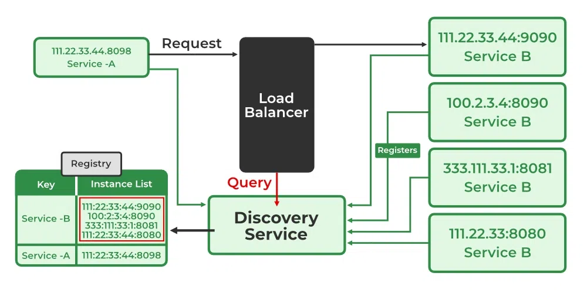

## 7. 엣지 서버 (Edge Server)

reverse proxy라고 불리기도 하는 그거. 해당 프로젝트는 istio ingress controller를 쓸 예정입니다.

kubernetes ingress controller는 중요 요소이지만, 별도로 언급하지는 않습니다.

nginx는 그냥 보라고 넣었습니다.

spring gateway는 이전에 사용했기 때문에 reference를 넣었습니다.

1. [istio ingress controller](https://istio.io/latest/docs/tasks/traffic-management/ingress/ingress-control/)

2. [kubernetes ingress controller](https://kubernetes.io/docs/concepts/services-networking/ingress/)

3. [nginx ingress controller](https://docs.nginx.com/nginx-ingress-controller/)

4. [spring gateway](https://spring.io/projects/spring-cloud-gateway)

## 8. 서비스 메시 (Service Mesh)

Service Mesh란 service application의 비지니스 로직이 아닌 부분들에 대해서 공통적인 관심사를 추출하여 처리하는 구조를 말합니다. 이는 Spring AOP와 비슷하다고 보시면 됩니다. NGINX가 설명이 잘 되어있어 해당 그림을 가져왔으나, 본 프로젝트에서는 **Istio**를 사용합니다.

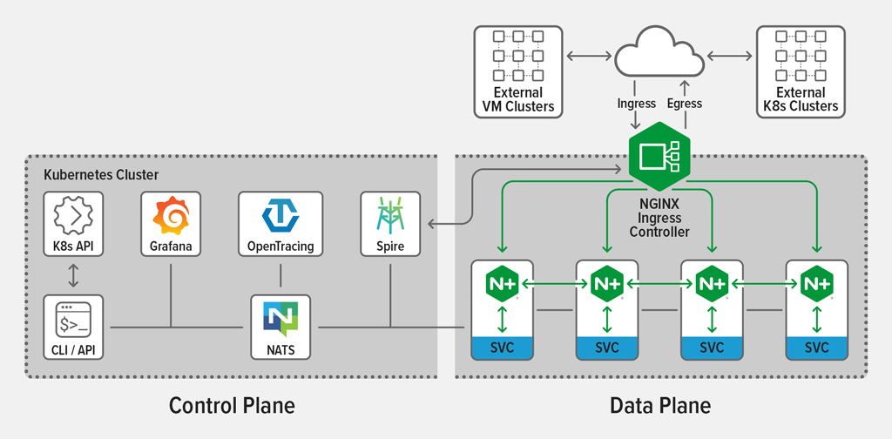

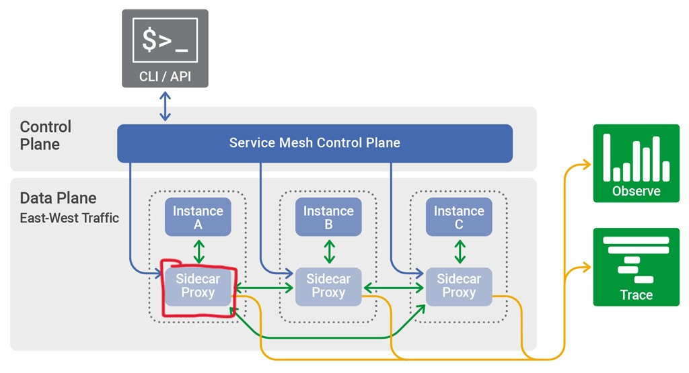

간략한 서비스 흐름은 다음과 같습니다. 물론 Istio 사용합니다. CDN 및 DDoS Protection은 없습니다.

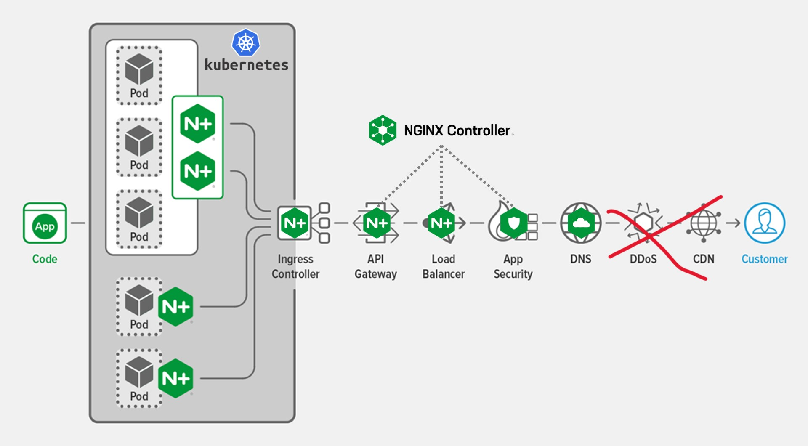

## 9. 프로젝트에 대하여 (요약)

해당 프로젝트는 Micro Service를 위해서 [Spring Cloud](https://spring.io/projects/spring-cloud)를 사용한 이후 kubernetes를 사용하였습니다.

프로젝트는 Rest Controller를 위주로 별도로 Front Application는 없이 rest api만 지원함을 목표로 하였습니다.

본 프로젝트는 크게 두 가지 프로젝트로 구성되어 있습니다.

1. hands-on: web flux([spring reactive](https://spring.io/reactive)) 기반 microservice OLTP
2. hy-oltp: web mvc 기반 monolithic [OLTP](https://ko.wikipedia.org/wiki/%EC%98%A8%EB%9D%BC%EC%9D%B8_%ED%8A%B8%EB%9E%9C%EC%9E%AD%EC%85%98_%EC%B2%98%EB%A6%AC) (참조: [OALP](https://ko.wikipedia.org/wiki/%EC%98%A8%EB%9D%BC%EC%9D%B8_%EB%B6%84%EC%84%9D_%EC%B2%98%EB%A6%AC)).
* hands-on은 OLTP이긴 하지만 "eventually consistency" concept를 지니고 있습니다. 즉 transaction이 엄밀하게 지켜지지는 않습니다.

마이크로 서비스가 주요 목표인 프로젝트에서, OLTP 서비스를 구현한 이유는 cloud 환경의 기능들을 잘 활용하면 기존의 어려운 문제점들을 해결하기 위한 하나의 실마리가 될 수 있다고 생각하였기 때문입니다.