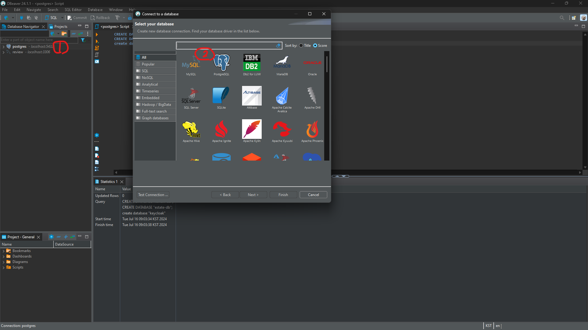
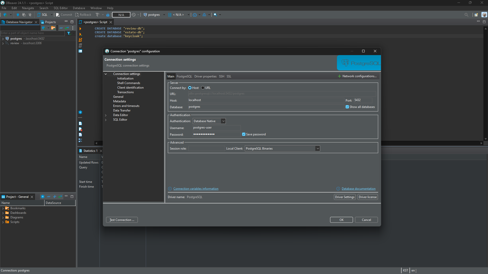

# Git Repository 설치 및 초기 설정

- [Git Repository 설치 및 초기 설정](#git-repository-설치-및-초기-설정)
- [Git repository pull](#git-repository-pull)
- [api 및 util artifact publishing](#api-및-util-artifact-publishing)
- [Ingress Gateway의 IP address에 대한 hostname 등록](#ingress-gateway의-ip-address에-대한-hostname-등록)
- [artifact build](#artifact-build)
- [minikube start \& import dependencies](#minikube-start--import-dependencies)
- [create configuration link file](#create-configuration-link-file)
- [Helm repository를 추가한다](#helm-repository를-추가한다)
- [install istio](#install-istio)
- [coredns update](#coredns-update)
- [Install persistence](#install-persistence)
- [Install redis](#install-redis)
- [Install Message Queue](#install-message-queue)
- [Install Logging](#install-logging)
- [Install Kubernetes Dashboard](#install-kubernetes-dashboard)


⚠️ ~는 project root를 의미한다.
⚠️ Prerequisite을 설치한 이후 컴퓨터를 다시 껐다 키는 것을 추천한다. environments가 업데이트 된다.

# Git repository pull

```
git init
git pull https://github.com/jjhnk/spring-ms-test.git
```

# api 및 util artifact publishing

```pwsh
# cd repository home
./gradlew api:publishToMavenLocal # publish api artifact
./gradlew util:publishToMavenLocal # publish util artifact

# confirm
cat $env:userprofile/.m2/repository/hy/microservices/api/api/maven-metadata-local.xml
cat $env:userprofile/.m2/repository/hy/microservices/util/util/maven-metadata-local.xml

# result
# <metadata>
#   <groupId>hy.microservices.util</groupId>
#   <artifactId>util</artifactId>
#   <versioning>
#     <latest>1.0.0</latest>
#     <release>1.0.0</release>
#     <versions>
#       <version>1.0.0-SNAPSHOT</version>
#       <version>1.0.0</version>
#     </versions>
#     <lastUpdated>20240711034416</lastUpdated>
#   </versioning>
# </metadata>
```

만약, vscode를 사용한다면, Gradle tab에서 별도로 publish 할 수 있다.


# Ingress Gateway의 IP address에 대한 hostname 등록

```pwsh
# run administrative shell

$MINIKUBE_HOSTS = "minikube.me grafana.minikube.me kiali.minikube.me prometheus.minikube.me tracing.minikube.me kibana.minikube.me elasticsearch.minikube.me mail.minikube.me alertmanager.minikube.me keycloak.minikube.me"
$hostsEntry = "127.0.0.1 $MINIKUBE_HOSTS"
$hostsPath = "C:\Windows\System32\drivers\etc\hosts"
Add-Content -Path $hostsPath -Value $hostsEntry

# to check
code $hostsPath
```

* 결과

``` txt
# Copyright (c) 1993-2009 Microsoft Corp.
#
# This is a sample HOSTS file used by Microsoft TCP/IP for Windows.
#
# This file contains the mappings of IP addresses to host names. Each
# entry should be kept on an individual line. The IP address should
# be placed in the first column followed by the corresponding host name.
# The IP address and the host name should be separated by at least one
# space.
#
# Additionally, comments (such as these) may be inserted on individual
# lines or following the machine name denoted by a '#' symbol.
#
# For example:
#
#      102.54.94.97     rhino.acme.com          # source server
#       38.25.63.10     x.acme.com              # x client host

# localhost name resolution is handled within DNS itself.
#	127.0.0.1       localhost
#	::1             localhost
# Added by Docker Desktop
112.187.173.59 host.docker.internal
112.187.173.59 gateway.docker.internal
# To allow the same kube context to work on the host and the container:
127.0.0.1 kubernetes.docker.internal
# End of section
127.0.0.1 minikube.me grafana.minikube.me kiali.minikube.me prometheus.minikube.me tracing.minikube.me kibana.minikube.me elasticsearch.minikube.me mail.minikube.me health.minikube.me alertmanager.minikube.me redis-insight.minikube.me kubernetes-dashboard.minikube.me keycloak.minikube.me
```

⚠️ Single Node이므로 hostname resolution이 동일한 localhost로 지정된다. 만약 multi node / cluster로서 별도로 namespace마다 static IP를 설정할 수 있다면, 해당 IP에 대해 hostname을 LAN 상의 DNS 시스템에 등록하는 것을 추천한다. 만약 LAN 상에서 등록이 힘들다면 프로젝트 참여자의 hosts에 적절한 domain을 별도로 등록하자. 예를 들어 아래와 같다. service port가 모두 다르므로 node가 모두 다를 필요는 없다.

```txt
# C:\Windows\System32\drivers\etc\hosts
...
192.168.67.30 grafana.minikube.me
192.168.67.31 kiali.minikube.me
...
```

⚠️ 해당 프로젝트는 적정 수준의 난이도를 목표로 한다. 따라서 DNS resolution이 충분하지 않아서 발생하는 문제가 어느 정도 존재한다. 이러한 문제는 차후 발생 시 언급하도록 한다.

⚠️ 127.0.0.1에 대한 DNS Resolution은 web browser에서는 정상적으로 작동한다. 하지만 다른 어플리케이션에서는 가장 첫 요소, minikube.me만 식별할 수 있다.

# artifact build

``` pwsh
cd ~
# create jar
./gradlew clean build
```

# minikube start & import dependencies

Minikube를 시작한다.

```
minikube start

# docker-compose build에서 필요한 image들을 pull하기 위해 시간이 매우 많이 소요될 수 있다.
# 아래는 이를 방지하기 위해 미리 필요한 image들을 미리 다운받기 위함이다.
# set docker-env as minikube
minikube -p minikube docker-env --shell powershell | Invoke-Expression

docker pull mongo:7.0.11
docker pull mysql:8.0.37 # delete this if not required.
docker pull postgres:latest
docker pull rabbitmq:3.13.3-management
docker pull openzipkin/zipkin
docker pull quay.io/keycloak/keycloak:25.0.1
docker pull docker.elastic.co/elasticsearch/elasticsearch:7.17.22
docker pull docker.elastic.co/kibana/kibana:7.17.22

# docker image build
docker-compose build
```

# create configuration link file

Configuration에 중앙 집중식 관리를 위해 symlink를 생성합니다.

```pwsh
# run administrative shell
$targetNamespace = "hands-on"
Get-ChildItem -Path "./config/repo" | ForEach-Object {
  if ($_.BaseName -ne "application" -and $_.BaseName -ne "gateway" -and $_.BaseName -ne "estate") {
    $relativeConfigAppPath = "./config/repo/application.yml"
    $absoluteConfigAppPath = (Resolve-Path -Path $relativeConfigAppPath).Path

    $relativeConfigPath = "./config/repo/" + $_.BaseName + ".yml"
    $absoluteConfigPath = (Resolve-Path -Path $relativeConfigPath).Path

    $relativeLogbackPath = "./config/logback-spring.xml"
    $absoluteLogbackPath = (Resolve-Path -Path $relativeLogbackPath).Path

    $targetRelFolderBase = "./kubernetes/helm/${targetNamespace}/components/" + $_.BaseName
    $targetRelFolder = $targetRelFolderBase + "/config/repo/"

    if (-not (Test-Path -Path $targetRelFolder)) {
      New-Item -Path $targetRelFolder -ItemType Directory
    }
    $targetAbsFolder = (Resolve-Path -Path $targetRelFolder).Path
    $targetFile = $targetAbsFolder + $_.BaseName + ".yml"
    New-Item -Path $targetFile -ItemType SymbolicLink -Value $absoluteConfigPath

    $targetFile = $targetAbsFolder + "application.yml"
    New-Item -Path $targetFile -ItemType SymbolicLink -Value $absoluteConfigAppPath

    $targetFile = $targetRelFolderBase + "/config/logback-spring.xml"
    New-Item -Path $targetFile -ItemType SymbolicLink -Value $absoluteLogbackPath
  }
}

$targetNamespace = "hy-oltp"
Get-ChildItem -Path "./config/repo" | ForEach-Object {
  if ($_.BaseName -eq "estate") {
    $relativeConfigAppPath = "./config/repo/application.yml"
    $absoluteConfigAppPath = (Resolve-Path -Path $relativeConfigAppPath).Path

    $relativeConfigPath = "./config/repo/" + $_.BaseName + ".yml"
    $absoluteConfigPath = (Resolve-Path -Path $relativeConfigPath).Path

    $relativeLogbackPath = "./config/logback-spring.xml"
    $absoluteLogbackPath = (Resolve-Path -Path $relativeLogbackPath).Path

    $targetRelFolderBase = "./kubernetes/helm/${targetNamespace}/components/" + $_.BaseName
    $targetRelFolder = $targetRelFolderBase + "/config/repo/"

    if (-not (Test-Path -Path $targetRelFolder)) {
      New-Item -Path $targetRelFolder -ItemType Directory
    }
    $targetAbsFolder = (Resolve-Path -Path $targetRelFolder).Path
    $targetFile = $targetAbsFolder + $_.BaseName + ".yml"
    New-Item -Path $targetFile -ItemType SymbolicLink -Value $absoluteConfigPath

    $targetFile = $targetAbsFolder + "application.yml"
    New-Item -Path $targetFile -ItemType SymbolicLink -Value $absoluteConfigAppPath

    $targetFile = $targetRelFolderBase + "/config/logback-spring.xml"
    New-Item -Path $targetFile -ItemType SymbolicLink -Value $absoluteLogbackPath
  }
}
```

# Helm repository를 추가한다

Helm repository jetstack (certmanager), kubernetes-dashboard, bitnami를 설치한다.

```pwsh
helm repo add jetstack https://charts.jetstack.io
helm repo update
 helm install cert-manager jetstack/cert-manager \
  --create-namespace \
  --namespace cert-manager \
  --set installCRDs=true \
  --wait
helm repo add bitnami https://charts.bitnami.com/bitnami
helm repo add kubernetes-dashboard https://kubernetes.github.io/dashboard/
```

# install istio

Istio를 설치한다.

```pwsh
istioctl experimental precheck
istioctl install --skip-confirmation --set meshConfig.accessLogFile=/dev/stdout --set meshConfig.accessLogEncoding=JSON --set values.pilot.env.PILOT_JWT_PUB_KEY_REFRESH_INTERVAL=15s -f kubernetes/istio-tracing.yml
kubectl -n istio-system wait --timeout=600s --for=condition=available deployment --all

$istio_version = istioctl version --short --remote=$false
kubectl apply -n istio-system -f https://raw.githubusercontent.com/istio/istio/${istio_version}/samples/addons/kiali.yaml
kubectl apply -n istio-system -f https://raw.githubusercontent.com/istio/istio/${istio_version}/samples/addons/jaeger.yaml
kubectl apply -n istio-system -f https://raw.githubusercontent.com/istio/istio/${istio_version}/samples/addons/prometheus.yaml
kubectl apply -n istio-system -f ./kubernetes/monitoring/grafana.yml
kubectl apply -n istio-system -f ./kubernetes/monitoring/alertmanager.yml
kubectl -n istio-system create deployment mail-server --image maildev/maildev:2.0.5
kubectl -n istio-system expose deployment mail-server --port=1080,1025 --type=ClusterIP
kubectl -n istio-system set env deployment/grafana GF_ALERTING_ENABLED=true  GF_UNIFIED_ALERTING_ENABLED=false  GF_SMTP_ENABLED=true  GF_SMTP_SKIP_VERIFY=true  GF_SMTP_HOST=mail-server:1025  GF_SMTP_FROM_ADDRESS=grafana@minikube.me
kubectl -n istio-system wait --timeout=60s --for=condition=ready pod -l app=mail-server
helm upgrade --install istio-hands-on-addons kubernetes/helm/environments/istio-system -n istio-system
kubectl apply -n kube-system
```

# coredns update

coredns는 kube-system의 domain name system이다. dns resoultion을 위해서 'rewrite name keycloak.minikube.me keycloak.auth.svc.cluster.local'를 추가한다.

```pwsh
kubectl apply -n kube-system -f ./kubernetes/kube-system/coredns-config.yml
```

# Install persistence

MongoDB, MySQL, PostgreSQL을 설치한다.

```pwsh
$target = "persistence"
$env = "env"

minikube -p minikube docker-env --shell powershell | Invoke-Expression
kubectl delete namespace $target
Get-ChildItem -Path "kubernetes/helm/${target}/components" -Directory | ForEach-Object { helm dep up $_.FullName } | Out-Null
Get-ChildItem -Path "kubernetes/helm/${target}/environments" -Directory | ForEach-Object { helm dep up $_.FullName } | Out-Null
kubectl apply -f "./kubernetes/namespaces/${target}-namespace.yml"
helm install "${target}-dev-env" "kubernetes/helm/${target}/environments/dev-env" -n $target
```

⚠️ postgres는 기본적으로 ddl auto-update가 disable이다. 그런데 hands-on 및 hy-oltp는 postgres에 의존하므로 별도로 database를 만들어줘야 한다.

```pwsh
kubectl port-forward services/postgres 5432:5432 -n persistence
```

DBeaver를 실행한다.

아래와 같이 DBeaver를 설정해준다. 계정 정보는 'postgres-user/postgres-pwd'이다.





SQL Editor를 통해 다음 DDL을 실행한다.

```sql
CREATE DATABASE "review-db";
CREATE DATABASE "estate-db";
CREATE DATABASE "keycloak";
```

# Install redis

Redis를 설치한다.

```pwsh
$target = "redis"
$env = "env"

minikube -p minikube docker-env --shell powershell | Invoke-Expression
kubectl delete namespace $target
Get-ChildItem -Path "kubernetes/helm/${target}/components" -Directory | ForEach-Object { helm dep up $_.FullName } | Out-Null
Get-ChildItem -Path "kubernetes/helm/${target}/environments" -Directory | ForEach-Object { helm dep up $_.FullName } | Out-Null
kubectl apply -f "./kubernetes/namespaces/${target}-namespace.yml"
helm install "${target}-dev-env" "kubernetes/helm/${target}/environments/dev-env" -n $target
```

# Install Message Queue

Rabbit MQ를 설치한다

```pwsh
$target = "message-queue"
$env = "env"

minikube -p minikube docker-env --shell powershell | Invoke-Expression
kubectl delete namespace $target
Get-ChildItem -Path "kubernetes/helm/${target}/components" -Directory | ForEach-Object { helm dep up $_.FullName } | Out-Null
Get-ChildItem -Path "kubernetes/helm/${target}/environments" -Directory | ForEach-Object { helm dep up $_.FullName } | Out-Null
kubectl apply -f "./kubernetes/namespaces/${target}-namespace.yml"
helm install "${target}-dev-env" "kubernetes/helm/${target}/environments/dev-env" -n $target
```

# Install Logging

Fluentd를 설치한다.

```pwsh
minikube -p minikube docker-env --shell powershell | Invoke-Expression
docker build -f kubernetes/efk/Dockerfile -t hands-on/fluentd:v1 kubernetes/efk/

kubectl apply -f kubernetes/efk/fluentd-hands-on-configmap.yml
kubectl apply -f kubernetes/efk/fluentd-ds.yml
kubectl wait --timeout=120s --for=condition=Ready pod -l app=fluentd -n kube-system
```

Elasticserach 및 Kibana를 설치한다.

```pwsh
$target = "logging"
$env = "env"

minikube -p minikube docker-env --shell powershell | Invoke-Expression
kubectl delete namespace $target
Get-ChildItem -Path "kubernetes/helm/${target}/components" -Directory | ForEach-Object { helm dep up $_.FullName } | Out-Null
Get-ChildItem -Path "kubernetes/helm/${target}/environments" -Directory | ForEach-Object { helm dep up $_.FullName } | Out-Null
kubectl apply -f "./kubernetes/namespaces/${target}-namespace.yml"
helm install "${target}-dev-env" "kubernetes/helm/${target}/environments/dev-env" -n $target
```

# Install Kubernetes Dashboard

Kubernetes Dashboard를 설치한다.

```pwsh
helm upgrade --install kubernetes-dashboard kubernetes-dashboard/kubernetes-dashboard --create-namespace --namespace kubernetes-dashboard

$target = "kubernetes-dashboard"
$env = "env"

minikube -p minikube docker-env --shell powershell | Invoke-Expression
kubectl delete namespace $target
Get-ChildItem -Path "kubernetes/helm/${target}/components" -Directory | ForEach-Object { helm dep up $_.FullName } | Out-Null
Get-ChildItem -Path "kubernetes/helm/${target}/environments" -Directory | ForEach-Object { helm dep up $_.FullName } | Out-Null
kubectl apply -f "./kubernetes/namespaces/${target}-namespace.yml"
helm install "${target}-dev-env" "kubernetes/helm/${target}/environments/dev-env" -n $target
```

Kubernetes Dashboard에 접근하기 위해서는 아래의 명령어를 통해 token을 획득해야 한다.

```pwsh
kubectl -n kubernetes-dashboard create token admin-user
```
