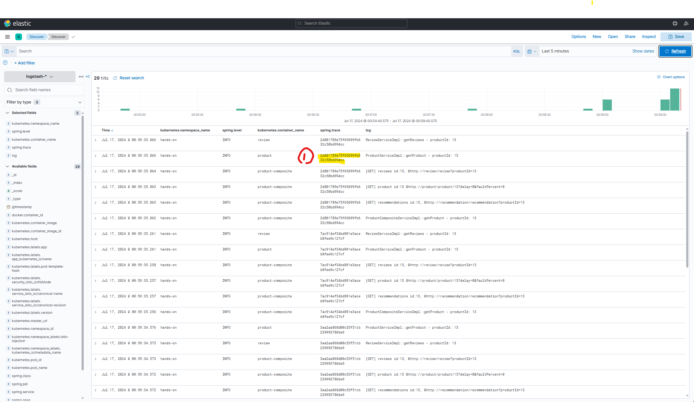

# Abstract

Spring Ms Test 프로젝트는 적절한 수준의 개발 환경을 제공하여 마이크로 서비스의 개발을 지원하는 것을 목표로 합니다. 이 프로젝트는 JAVA와 Spring을 중심으로 개발되었으며, 마이크로 서비스는 클라우드 컴퓨팅 환경에서의 운영을 목표로 Docker와 Kubernetes를 사용합니다.

적절한 수준이란, 엔터프라이즈 레벨의 서비스를 구축하기 위해 필요한 다양한 도구들을 간단하게 테스트할 수 있는 수준을 의미합니다. 다시 말해, 개발 환경을 운영하기 위해 다양한 best practices 를 따르기보다는, 기본 기능을 쉽게 확인할 수 있도록 설정했습니다.

이 프로젝트의 구조는 이를 잘 보여줍니다. 일반적인 모놀리식 프로젝트는 단일 레포지토리를 사용하지만, 엔터프라이즈 수준의 마이크로 서비스 프로젝트는 다중 레포지토리 구조를 가집니다. 이 레포지토리는 두 가지 구조의 장점을 결합하여, 하나의 레포지토리가 여러 프로젝트를 포함할 수 있도록 설계되었습니다.

차후 RECAP에서는 프로젝트를 어떻게 발전시켜 나갈지에 대해 간단히 논의하겠습니다.

목차:

- [Abstract](#abstract)
- [Features](#features)
- [Prerequisite](#prerequisite)
- [Getting Started](#getting-started)
  - [시스템 구성도](#시스템-구성도)
- [Related Documentations](#related-documentations)
- [RECAP](#recap)

# Features

링크: [Features](./docs/featuers.md)

목차:

- [1. 모니터링 (Monitoring)](./docs/featuers.md/#1-모니터링-monitoring)
- [2. 로깅 (Logging, Distributed Tracing)](./docs/featuers.md/#2-로깅-logging-distributed-tracing)
- [3. 중앙집중적 API Documentation (Centralized Documentation)](./docs/featuers.md/#3-중앙집중적-api-documentation-centralized-documentation)
- [4. 인증 (Authentication)](./docs/featuers.md/#4-인증-authentication)
- [5. 중앙집중적 환경설정 (Centralized Configuration)](./docs/featuers.md/#5-중앙집중적-환경설정-centralized-configuration)
- [6. 서비스 디스커버리 (Service Discovery)](./docs/featuers.md/#6-서비스-디스커버리-service-discovery)
- [7. 엣지 서버 (Edge Server)](./docs/featuers.md/#7-엣지-서버-edge-server)
- [8. 서비스 메시 (Service Mesh)](./docs/featuers.md/#8-서비스-메시-service-mesh)
- [9. 프로젝트에 대하여 (요약)](./docs/featuers.md/#9-프로젝트에-대하여-요약)

# Prerequisite

해당 프로젝트는 Windows 환경에서 WSL DOCKER에 기반합니다. Linux Distribution 및 macOS는 지원하지 않습니다.

관련 어플리케이션은은 Chocolatey를 기반으로 다운로드 합니다. 다른 Installation 방식이 있다면 해당 방식을 사용하시면 됩니다.

PowerShell을 기반으로 운영합니다. PowerShell의 원할한 운영을 위해 7.4.x 버전 이상을 사용합니다.

개발 환경은 vscode를 기준으로 구현됩니다. 다른 도구는 상황에 맞게 적용하면 됩니다.

⚠️ 아래는 Windows 11 / PowerShell을 기준으로 설명되었으나, 별도로 다른 방식으로 패키지 관리를 한다면 다른 방식을 사용하면 됩니다.

링크: [Prerequisite](./docs/prerequisite.md)

- [Requirements](./docs/prerequisite.md#requirements)
  - [PowerShell](./docs/prerequisite.md#powershell)
  - [Chocolatey](./docs/prerequisite.md#chocolatey)
  - [WSL](./docs/prerequisite.md#wsl)
  - [Docker](./docs/prerequisite.md#docker)
  - [Visual Studio Code](./docs/prerequisite.md#visual-studio-code)
    - [VSCode 관련 extension](./docs/prerequisite.md#vscode-관련-extension)
  - [Java](./docs/prerequisite.md#java)
  - [Gradle](./docs/prerequisite.md#gradle)
  - [Minikube, Kubenetes-cli, Istioctl, Helm](./docs/prerequisite.md#minikube-kubenetes-cli-istioctl-helm)
  - [Maven](./docs/prerequisite.md#maven)
  - [DBeaver](./docs/prerequisite.md#dbeaver)
- [Optional](./docs/prerequisite.md#optional)
  - [Git For Windows](./docs/prerequisite.md#git-for-windows)
  - [Nexus OSS](./docs/prerequisite.md#nexus-oss)
  - [JMeter](./docs/prerequisite.md#jmeter)
  - [Terminal](./docs/prerequisite.md#terminal)

# Getting Started

## 시스템 구성도


링크: [Getting Started](./docs/getting-started.md)

 [Git Repository 설치 및 초기 설정](./docs/getting-started.md#git-repository-설치-및-초기-설정)
- [Git repository pull](./docs/getting-started.md#git-repository-pull)
- [api 및 util artifact publishing](./docs/getting-started.md#api-및-util-artifact-publishing)
- [Ingress Gateway의 IP address에 대한 hostname 등록](./docs/getting-started.md#ingress-gateway의-ip-address에-대한-hostname-등록)
- [artifact build](./docs/getting-started.md#artifact-build)
- [minikube start \& import dependencies](./docs/getting-started.md#minikube-start--import-dependencies)
- [create configuration link file](./docs/getting-started.md#create-configuration-link-file)
- [Helm repository를 추가한다](./docs/getting-started.md#helm-repository를-추가한다)
- [install istio](./docs/getting-started.md#install-istio)
- [coredns update](./docs/getting-started.md#coredns-update)
- [Install persistence](./docs/getting-started.md#install-persistence)
- [Install redis](./docs/getting-started.md#install-redis)
- [Install Message Queue](./docs/getting-started.md#install-message-queue)
- [Install Logging](./docs/getting-started.md#install-logging)
- [Install Kubernetes Dashboard](./docs/getting-started.md#install-kubernetes-dashboard)

⚠️ 위의 과정은 별도로 검증없이 작성되어 오류가 있을 수 있습니다. 오류를 발견할 경우 issue에 제보를 요청드립니다.

1. 초기 설정이 끝난 다음 app artifact를 배포한다.

```pwsh
# hands-on 배포
# jar artifact 업데이트
minikube -p minikube docker-env -u --shell powershell | Invoke-Expression
./gradlew build

# docker iamge 업데이트
minikube -p minikube docker-env --shell powershell | Invoke-Expression
docker-compose build

$target = "hands-on"
$env = "dev-env"
kubectl delete namespace $target
Get-ChildItem -Path "kubernetes/helm/$target/components" -Directory | ForEach-Object { helm dep up $_.FullName } | Out-Null
Get-ChildItem -Path "kubernetes/helm/$target/environments" -Directory | ForEach-Object { helm dep up $_.FullName } | Out-Null
kubectl apply -f "./kubernetes/namespaces/${target}-namespace.yml"
helm install "${target}-dev-env" "kubernetes/helm/$target/environments/$env" -n "$target"
helm upgrade "${target}-dev-env" "kubernetes/helm/$target/environments/dev-env" -n "$target"

# 위에서 이미 jar artifact 및 docker image가 배포 되었으므로 생략
$target = "hy-oltp"
$env = "dev-env"
kubectl delete namespace $target
Get-ChildItem -Path "kubernetes/helm/$target/components" -Directory | ForEach-Object { helm dep up $_.FullName } | Out-Null
Get-ChildItem -Path "kubernetes/helm/$target/environments" -Directory | ForEach-Object { helm dep up $_.FullName } | Out-Null
kubectl apply -f "./kubernetes/namespaces/${target}-namespace.yml"
helm install "${target}-dev-env" "kubernetes/helm/$target/environments/$env" -n "$target"
helm upgrade "${target}-dev-env" "kubernetes/helm/$target/environments/dev-env" -n "$target"
```

2. kubernetes tab을 클릭하고 all-green이 될때까지 기다린다.


3. minikube tunnel을 실행한다.

```pwsh
minikube tunnel
```

4. tab group을 켜고 아래의 service들을 등록한다.

```txt
https://kiali.minikube.me/
https://kubernetes-dashboard.minikube.me/
https://grafana.minikube.me/
https://kibana.minikube.me/
https://tracing.minikube.me/
https://mail.minikube.me/
https://prometheus.minikube.me/
https://alertmanager.minikube.me/
https://redis-insight.minikube.me/
https://minikube.me/product-composite/openapi/swagger-ui.html
https://keycloak.minikube.me/
```

4.1. kubernetes-dashboardh

https://kubernetes-dashboard.minikube.me/ 에 접속하기 위해서는 아래의 명령어를 통해 token을 획득해야 한다.

```
kubectl -n kubernetes-dashboard create token admin-user
```

https://grafana.minikube.me/ 를 활용하기 위해서는 다음을 참조한다.

JVM (Micrometer)를 활성화하기 위해 다음을 import한다.

* [Dashboards]
* [Import]
* [Import via grafana.com]에 17175를 입력한다.


* 아래 request를 요청한다.

```
curl --location 'https://grafana.minikube.me/api/dashboards/db' \
--header 'Content-Type: application/json' \
--data '{"meta":{"type":"db","canSave":true,"canEdit":true,"canAdmin":true,"canStar":false,"canDelete":true,"slug":"hands-on-dashboard","url":"/d/ZF5_6XwVk/hands-on-dashboard","expires":"0001-01-01T00:00:00Z","created":"2023-05-31T16:17:58Z","updated":"2023-05-31T16:54:43Z","updatedBy":"Anonymous","createdBy":"Anonymous","version":5,"hasAcl":false,"isFolder":false,"folderId":0,"folderUid":"","folderTitle":"General","folderUrl":"","provisioned":false,"provisionedExternalId":"","annotationsPermissions":{"dashboard":{"canAdd":true,"canEdit":true,"canDelete":true},"organization":{"canAdd":true,"canEdit":true,"canDelete":true}},"isPublic":false},"dashboard":{"annotations":{"list":[{"builtIn":1,"datasource":{"type":"grafana","uid":"-- Grafana --"},"enable":true,"hide":true,"iconColor":"rgba(0, 211, 255, 1)","name":"Annotations & Alerts","target":{"limit":100,"matchAny":false,"tags":[],"type":"dashboard"},"type":"dashboard"}]},"editable":true,"fiscalYearStartMonth":0,"graphTooltip":0,"id":null,"links":[],"liveNow":false,"panels":[{"datasource":{"type":"prometheus","uid":"PBFA97CFB590B2093"},"fieldConfig":{"defaults":{"color":{"mode":"palette-classic"},"custom":{"axisLabel":"","axisPlacement":"auto","barAlignment":0,"drawStyle":"line","fillOpacity":0,"gradientMode":"none","hideFrom":{"legend":false,"tooltip":false,"viz":false},"lineInterpolation":"linear","lineWidth":1,"pointSize":5,"scaleDistribution":{"type":"linear"},"showPoints":"auto","spanNulls":false,"stacking":{"group":"A","mode":"none"},"thresholdsStyle":{"mode":"off"}},"mappings":[],"thresholds":{"mode":"absolute","steps":[{"color":"green","value":null},{"color":"red","value":80}]}},"overrides":[]},"gridPos":{"h":6,"w":24,"x":0,"y":0},"id":4,"options":{"legend":{"calcs":[],"displayMode":"list","placement":"bottom"},"tooltip":{"mode":"multi","sort":"none"}},"targets":[{"datasource":{"type":"prometheus","uid":"PBFA97CFB590B2093"},"editorMode":"builder","expr":"rate(resilience4j_retry_calls_total[30s])","interval":"","legendFormat":"{{kind}}","range":true,"refId":"A"}],"title":"Retry","type":"timeseries"},{"alert":{"alertRuleTags":{},"conditions":[{"evaluator":{"params":[0.5],"type":"lt"},"operator":{"type":"and"},"query":{"params":["A","10s","now"]},"reducer":{"params":[],"type":"max"},"type":"query"}],"executionErrorState":"alerting","for":"0m","frequency":"10s","handler":1,"name":"Circuit Breaker alert","noDataState":"no_data","notifications":[]},"datasource":{"type":"prometheus","uid":"PBFA97CFB590B2093"},"fieldConfig":{"defaults":{"color":{"mode":"palette-classic"},"custom":{"axisLabel":"","axisPlacement":"auto","barAlignment":0,"drawStyle":"line","fillOpacity":0,"gradientMode":"none","hideFrom":{"legend":false,"tooltip":false,"viz":false},"lineInterpolation":"linear","lineWidth":1,"pointSize":5,"scaleDistribution":{"type":"linear"},"showPoints":"auto","spanNulls":false,"stacking":{"group":"A","mode":"none"},"thresholdsStyle":{"mode":"off"}},"mappings":[],"thresholds":{"mode":"absolute","steps":[{"color":"green","value":null},{"color":"red","value":80}]}},"overrides":[]},"gridPos":{"h":5,"w":24,"x":0,"y":6},"id":2,"options":{"legend":{"calcs":[],"displayMode":"list","placement":"bottom"},"tooltip":{"mode":"multi","sort":"none"}},"targets":[{"datasource":{"type":"prometheus","uid":"PBFA97CFB590B2093"},"editorMode":"builder","expr":"resilience4j_circuitbreaker_state{state=\"closed\"}","legendFormat":"{{state}}","range":true,"refId":"A"},{"datasource":{"type":"prometheus","uid":"PBFA97CFB590B2093"},"editorMode":"builder","expr":"resilience4j_circuitbreaker_state{state=\"open\"}","hide":false,"legendFormat":"{{state}}","range":true,"refId":"B"},{"datasource":{"type":"prometheus","uid":"PBFA97CFB590B2093"},"editorMode":"builder","expr":"resilience4j_circuitbreaker_state{state=\"half_open\"}","hide":false,"legendFormat":"{{state}}","range":true,"refId":"C"}],"thresholds":[{"colorMode":"critical","op":"lt","value":0.5,"visible":true}],"title":"Circuit Breaker","type":"timeseries"},{"datasource":{"type":"prometheus","uid":"PBFA97CFB590B2093"},"gridPos":{"h":6,"w":24,"x":0,"y":11},"id":6,"options":{"alertName":"","dashboardAlerts":true,"dashboardTitle":"","maxItems":10,"showOptions":"changes","sortOrder":1,"stateFilter":{"alerting":false,"execution_error":false,"no_data":false,"ok":false,"paused":false,"pending":false},"tags":[]},"pluginVersion":"9.0.1","title":"Circuit Breaker Alerts ","type":"alertlist"}],"refresh":"","schemaVersion":36,"style":"dark","tags":[],"templating":{"list":[]},"time":{"from":"now-5m","to":"now"},"timepicker":{},"timezone":"","title":"Hands-on Dashboard","uid":"ZF5_6XwVk","version":3,"weekStart":""}}'
```

4.2. elasticserach

Stack Management로 갑니다.


Index Pattern에 logstash-*를 입력하고, tag를 time으로 설정합니다.


log Dashboard를 설정하기 위해 Dashboard로 이동합니다.


6에 kubernetes.namespace.name.keyword를 입력하고 오른쪽으로 드래그합니다. 모양은 도넛으로 지정합니다.


8에 kubernetes.continaer.name.keyword를 입력하고 오른쪽으로 드래그합니다.


오른쪽 위에서 Save To library를 누르고 이름을 대충 적당한걸로 짓습니다.

다음 화면에서 오른쪽 위에서 Save를 누르고 이름을 대충 적당한걸로 짓습니다.


오른쪽 Discover를 눌러 실시간 로그 목록을 확인합니다.


Search field names에서 차례로 아래와 같이 입력합니다.

* kubernetes.namespace.name
* spring.level
* kubernetes.container.name
* spring.trace (⚠️ 중요)
* log


오른쪽 위의 Save 버튼을 누르고 적당한 이름을 짓고 저장합니다.


4.2.1 Jaeger와 연계

⚠️ 현재는 이러한 기능이 있다는 것만 알아두세요. 실습은 나중에.

관심이 있는 trace 중 하나를 ctrl + c합니다.



'https://tracing.minikube.me/'로 접속하여 2에 ctrl + v합니다.


로그를 분석합니다.


이와 별개로 전후 관계 분석이 필요한 경우가 있는데, 이는 추후에 다루겠습니다.


4.3 Keycloak

'https://keycloak.minikube.me/'에 접속합니다. 계정은 'admin/admin'입니다.

create realm을 누릅니다.


realm dev를 생성합니다.


Clients Scope에서 create client scope를 클릭합니다.


Settings에서 Name을 estate, type을 None으로 설정하고, Include in token scope를 On으로 설정합니다. (Default는 보안 관리 상 안 좋습니다.)


Clients에서 account-console을 클릭합니다.


Client Scopes tab에서 add client scopes를 클릭합니다.


estate를 체크하고 Default로 설정합니다.


microprofile-jwt를 Default로 설정합니다.


Users tab에서 Create New User를 선택합니다.


Username을 user로 하고 create를 누릅니다.


Password를 pass로 설정합니다.


Realm settings에서 User registration, Forgot password 및 Remember Me를 선택합니다.


Clients tab에서 account-console에 있는 link를 클릭합니다.


Devtools를 활성화 한 뒤, Account Console에서 'user/pass'를 입력하고 sign in을 합니다.


⚠️ token의 scope에서 estate가 설정되어 있는 것을 확인합니다.


https://minikube.me/estate/openapi/swagger-ui.index.html에 접속한 후

Authorize에서 해당 토큰을 입력하고 login합니다.

POST /estate/building에서 Try it out을 선택한 뒤 아래 body를 입력하고, try it out을 선택합니다. (units는 개인적인 개발 한계를 확인하기 위해 넣은 것이며 현재는 별도로 영향이 없습니다.)

```json
{"id":0,"name":"string","address":"string","city":"string","state":"string","zipCode":"string","description":"string"}
```

200 Ok를 확인합니다.


# Related Documentations

# RECAP